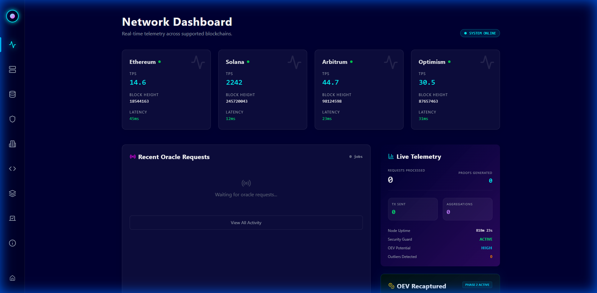

# OBSCURA: Enterprise-Grade Privacy-First Oracle Network 🌌

[](https://github.com/obscura-network/obscura)
[](https://opensource.org/licenses/MIT)
[](https://golang.org/)
[](https://soliditylang.org/)
[](https://discord.gg/obscura)

Obscura is a **production-grade decentralized oracle network** that combines **zero-knowledge privacy** with enterprise-grade reliability. The first oracle to offer ZK range proofs, selective disclosure, and compliant data feeds for Real World Assets (RWA).



---

## 🚀 Key Features

### 🔐 Zero-Knowledge Privacy Layer
- **Range Proofs**: Prove "BTC > $65k" without revealing exact price
- **TWAP Verification**: Time-weighted averages with hidden raw data
- **Proof of Reserves**: Cryptographic solvency attestations
- **Selective Disclosure**: Reveal data only to authorized auditors

### ⚡ Dual Oracle Architecture
- **Push Model**: WebSocket streaming with <500ms latency
- **Pull Model**: On-demand with 7-day Merkle proof caching
- **OCR Consensus**: 90% gas savings via off-chain aggregation

### 🌐 Multi-Chain Support
- **15+ Chains**: Ethereum, Arbitrum, Base, Optimism, Polygon, Avalanche, BNB, zkSync, Linea, Scroll, Mantle, Solana
- **Unified Feed Registry**: Same API across all chains
- **Cross-Chain Sync**: ZK-verified bridge proofs

### 🛡️ Enterprise Security
- **Staking & Slashing**: 10,000 token minimum, automatic penalties
- **MAD Outlier Detection**: Median Absolute Deviation filtering
- **Circuit Breaker**: Auto-verification on >10% price swings
- **Multi-sig Admin**: Gnosis Safe with 48hr time-locks

---

## 📦 Project Structure

```
obscura/
├── backend/                    # Go Oracle Node
│   ├── chains/                 # Multi-chain adapters (EVM, Solana, Cosmos)
│   ├── consensus/              # OCR off-chain reporting
│   ├── oracle/                 # Core oracle logic
│   │   ├── push/               # WebSocket streaming
│   │   └── pull/               # Merkle cache & proofs
│   ├── zkp/                    # Gnark ZK circuits
│   │   ├── zkp.go              # Range, VRF, Bridge proofs
│   │   └── advanced_circuits.go # TWAP, PoR, Selective Disclosure
│   ├── vrf/                    # Verifiable Random Function
│   ├── automation/             # Keeper/Trigger system
│   ├── node/                   # Node orchestration
│   └── api/                    # REST & metrics endpoints
├── contracts/                  # Solidity Smart Contracts
│   ├── contracts/
│   │   ├── ObscuraOracle.sol   # Core oracle + VRF
│   │   ├── StakeGuard.sol      # Staking & slashing
│   │   ├── NodeRegistry.sol    # Decentralized node list
│   │   └── Verifier.sol        # Gnark-exported ZK verifier
│   ├── integrations/
│   │   └── AaveV3Adapter.sol   # Aave V3 price oracle adapter
│   └── scripts/                # Deployment scripts
├── frontend/                   # React + Three.js Dashboard
├── sdk/
│   └── typescript/             # TypeScript SDK with React hooks
├── monitoring/                 # Prometheus, Grafana, Alertmanager
├── Documentations/             # Whitepapers, guides, pitch materials
└── docker-compose.yml          # Production deployment
```

---

## 🛠️ Quick Start

### Prerequisites
- Go 1.21+
- Node.js 18+
- Docker & Docker Compose

### 1. Clone & Setup

```bash
git clone https://github.com/obscura-network/obscura.git
cd obscura
cp .env.example .env
# Edit .env with your configuration
```

### 2. Deploy Smart Contracts

```bash
cd contracts
npm install
npx hardhat compile

# Deploy to testnet
npx hardhat run scripts/deploy.js --network sepolia
```

### 3. Run Backend Node

```bash
cd backend
go mod tidy
go build -o obscura-node ./cmd/obscura
./obscura-node
```

### 4. Launch Frontend

```bash
cd frontend
npm install
npm run dev
```

### 5. Production (Docker)

```bash
docker-compose up -d
# Access dashboard at http://localhost:3000
# Metrics at http://localhost:9091
```

---

## 📚 SDK Usage

### TypeScript/JavaScript

```typescript
import { ObscuraClient } from '@obscura/sdk';

const client = new ObscuraClient({ 
  chain: 'base', 
  apiKey: 'your-api-key' 
});

// Pull model - get price with ZK proof
const priceData = await client.getPrice('ETH/USD', { 
  proof: true,
  maxAge: 60 
});
console.log(`ETH/USD: ${priceData.value}`);

// Push model - subscribe to real-time updates
client.subscribe('ETH/USD', (update) => {
  console.log(`New price: ${update.value}`);
});

// VRF - request verifiable randomness
const vrf = await client.requestRandomness({ seed: 'my-seed' });
console.log(`Random: ${vrf.randomWords[0]}`);
```

### React Hooks

```tsx
import { usePrice, usePriceStream, useVRF } from '@obscura/sdk';

function PriceDisplay() {
  const { data, loading, error } = usePrice('ETH/USD');
  
  if (loading) return <div>Loading...</div>;
  return <div>ETH/USD: {data?.value}</div>;
}
```

---

## 📄 Smart Contract Integration

### Chainlink-Compatible Interface

```solidity
import "@obscura/contracts/interfaces/IObscuraOracle.sol";

contract MyProtocol {
    IObscuraOracle public oracle;
    
    function getLatestPrice() public view returns (int256) {
        (
            uint80 roundId,
            int256 answer,
            uint256 startedAt,
            uint256 updatedAt,
            uint80 answeredInRound
        ) = oracle.latestRoundData();
        
        require(answer > 0, "Invalid price");
        return answer;
    }
}
```

### Aave V3 Integration

See `contracts/integrations/AaveV3Adapter.sol` for a complete example.

---

## 📊 Monitoring

### Health Check
```bash
curl http://localhost:8080/health
```

### Prometheus Metrics
```bash
curl http://localhost:8080/metrics/prometheus
```

### Key Metrics
- `obscura_requests_total` - Total requests processed
- `obscura_request_latency_ms` - Request latency
- `obscura_proofs_generated` - ZK proofs generated
- `obscura_errors_total` - Error count

---

## 🔗 Links

- **Website**: [obscura.network](https://obscura.network)
- **Documentation**: [docs.obscura.network](https://docs.obscura.network)
- **Discord**: [discord.gg/obscura](https://discord.gg/obscura)
- **Twitter**: [@ObscuraOracle](https://twitter.com/ObscuraOracle)

---

## 📋 Documentation

| Document | Description |
|----------|-------------|
| [Enterprise Upgrade Roadmap](Documentations/ENTERPRISE_UPGRADE_ROADMAP.md) | Strategic implementation plan |
| [Competitive Analysis](Documentations/COMPETITIVE_ANALYSIS.md) | vs. Chainlink, Pyth, RedStone, API3 |
| [Node Operator Manual](Documentations/NODE_OPERATOR_MANUAL.md) | Setup and operations guide |
| [Investor One-Pager](Documentations/INVESTOR_ONE_PAGER.md) | Series A summary |
| [Implementation Summary](Documentations/IMPLEMENTATION_SUMMARY.md) | Technical status |

---

## 🤝 Contributing

We welcome contributions! Please see our [Contributing Guide](CONTRIBUTING.md) for details.

1. Fork the repository
2. Create your feature branch (`git checkout -b feature/amazing-feature`)
3. Commit your changes (`git commit -m 'Add amazing feature'`)
4. Push to the branch (`git push origin feature/amazing-feature`)
5. Open a Pull Request

---

## 📄 License

MIT License - see [LICENSE](LICENSE) for details.

---

## 🏆 Acknowledgments

- [Gnark](https://github.com/ConsenSys/gnark) - ZK proof library
- [go-ethereum](https://github.com/ethereum/go-ethereum) - Ethereum client
- [OpenZeppelin](https://openzeppelin.com/) - Smart contract security

---

**Built with ❤️ by the Obscura Network team**

*Privacy is not a feature. It's a right.*
