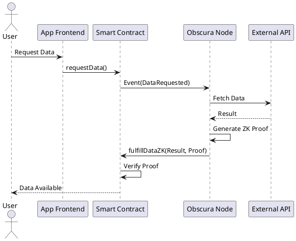

# Obscura Network Architecture

## Overview
Obscura Network is a privacy-preserving, AI-enhanced blockchain oracle platform. It leverages Zero-Knowledge Proofs (ZKPs) to ensure data confidentiality and integrity, while offering advanced features like AI predictive feeds and cross-chain bridging.

## System Components

### 1. Obscura Nodes (Backend - Golang)
- **Core Node (`node/`)**: Manages lifecycle, P2P communication, and job orchestration.
- **Jobs Engine (`node/jobs.go`)**: Handles request acceptance, data fetching, and aggregation.
- **Adapters (`adapters/`)**: Interfaces with external APIs. Supports "Obscura Mode" (TEE/Mixnet simulation).
- **AI Module (`ai/`)**: Uses Gonum for predictive analytics on data feeds.
- **VRF (`vrf/`)**: Generates verifiable randomness.
- **WASM Compute (`functions/`)**: Executes off-chain logic using Wazero.

### 2. Smart Contracts (Solidity/Hardhat)
- **ObscuraOracle**: Main entry point for requests and ZK fulfillment verification.
- **ObscuraToken (OBS)**: ERC-20 utility and governance token.
- **StakeGuard**: Manages staking, locking, and slashing.
- **CrossLink**: secure cross-chain messaging bridge.

### 3. Frontend (React/Three.js)
- **Dashboard**: Immersive 3D visualization of the network.
- **Node Manager**: AI-driven node registration and monitoring.
- **Staking Interface**: Visual liquid staking management.

## Data Flow
1. **Request**: User/Contract calls `ObscuraOracle.requestData`.
2. **Event**: Node detects `DataRequested` event.
3. **Fetch**: Node fetches data via `Adapters`.
4. **Privacy**: If restricted, data is processed in enclave/ZK circuit.
5. **Aggregate**: Median/Consensus reached off-chain.
6. **Prove**: ZK Proof generated (Mocked in prototype).
7. **Fulfill**: Node submits result + proof to `ObscuraOracle.fulfillDataZK`.

## Diagram (PlantUML)

